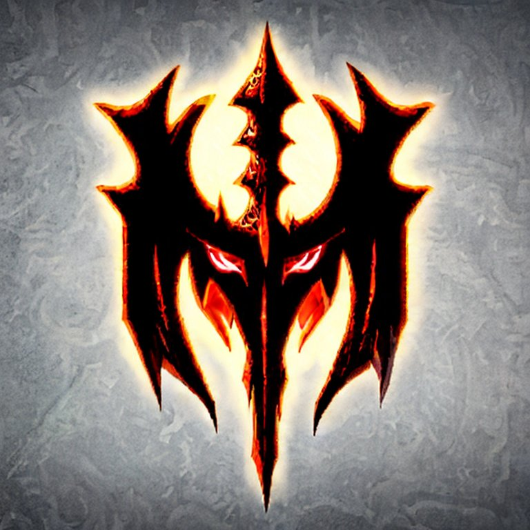

# Disclaimer

<p align="center">
    
    <p align="center" style="font-style:italic;"><em>Image generated with Stable-Diffusion</em></p>
</p>

> The information for the equipment contained in this repository has been extracted from an official source. All rights to the data belong to [Blizzard](https://us.diablo3.blizzard.com/en-us/). This repository is provided for educational purposes only and should not be considered an official source of information. We are not responsible for any inaccuracies or errors in the data provided here. Please refer to the official source for updated and accurate information.

# Getting started

I used [this document](https://learn.microsoft.com/en-us/minecraft/creator/documents/introductiontoloottables) as reference to start thinking around the loot table.

## Python virtual env

```bash
# Install required libraries to work with the loot system
pip install -r requirements.txt

# Initialize the virtual environment
python -m venv venv && source venv/bin/activate
```

# General overview

- The main file `loot.py` is where the functionalities are brought together to start a loot process using character and source information.
- The module `character.py` allow us to build a new character along with the relevant class types and validations when assigning levels.
- The `scrapper folder`, where the real game items from Diablo 3 official website are extracted for subsequent processing in json files.
- The data folder contains all the information about the items that the loot will work with, as well as the master table `loot_table.json` that defines the generation rules.

## Update the equipment .json files

If you want to update the equipment list, simply run:

```python
python scrapper/equipment.py
```

and it will update the .json files inside data folder except for `loot_table.json` which is the master table and needs to be updated manually.

# Starting a loot

We can customize the inputs to generate loots for differente characters, levels and the number of simulations to made

```python
# Make sure you are using the virtual environment before execute it
source venv/bin/activate

# Examples
(venv) ➜ python loot.py --level 61 -c monk
(venv) ➜ python loot.py -l 50 --character_class "witch doctor" # Wrap around quotes to allow whitespaces
(venv) ➜ python loot.py --level 2 -c wizard --num-simulations 10000
```


